# Lab1 测试报告（当前加固版本）

本文档记录的是本组在当前测试加固版本上的系统测试结果。这里的“当前版本”不是最早能跑通演示的那一版，而是已经在测试过程中修复过若干真实问题之后的版本，例如：

1. 分页参数非法时会稳定返回 `400`，而不是直接出现服务端异常。
2. `sortBy=rank` 时，页码超出范围会返回空页，不再因为 `subList` 越界而报错。
3. 未登录、令牌失效、权限不足时，后端会统一返回 JSON 错误体，前端可以稳定显示错误信息。
4. 当前端保存了失效 Token 时，页面会自动清理本地登录态并跳回登录页，而不会卡在任务页报错。
5. 前端从 `127.0.0.1` 访问时的跨域问题已经修复，浏览器端真实回归测试能够稳定跑通。

这份报告不再只给出一个“测试项总表”，而是直接把当前测试套件拆成 `Test1` 到 `Test15`。这样在实验报告和答辩中，可以非常明确地说明：注册功能是哪几个测试覆盖的，登录和鉴权是哪几个测试覆盖的，个人任务功能和分页边界是哪几个测试覆盖的。

## 1. 测试环境与执行方式

本次测试的目标不是“证明代码能偶尔跑通一次”，而是验证当前项目是否已经形成了一个稳定的、可重复验证的 Lab1 最小可运行版本。

测试环境如下：

- 操作系统：macOS
- 后端框架：Spring Boot 3
- 前端框架：React + Vite
- 数据库：H2
- 后端测试工具：JUnit 5、Spring Boot Test、MockMvc、TestRestTemplate
- 浏览器验收工具：Playwright

本轮测试分成三层：

1. 后端自动化测试  
   通过 `./mvnw test` 运行当前后端全部 `15` 项测试，覆盖启动、算法、注册、登录、任务 CRUD、接口校验、分页边界等内容。
2. 前端工程测试  
   运行 `npm run lint` 和 `npm run build`，确认页面代码质量和构建结果都正常。
3. 浏览器真实回归  
   在本地同时启动前后端后，用 Playwright 走真实页面流程，补充注册、登录、创建任务、删除任务、筛选、分页、失效 Token 等截图。

本轮执行的主要命令如下：

```bash
cd backend
./mvnw test

cd ../frontend
npm run lint
npm run build
```

本轮结果如下：

- 后端测试：`15` 项全部通过
- 前端静态检查：通过
- 前端构建：通过
- 浏览器端验收：通过

## 2. Test1-Test15 与功能要求的对应关系

下面先给出一个总览。后面的章节会按 `Test1` 到 `Test15` 逐条展开。

| 测试编号 | 对应测试实现 | 功能归属 | 说明 |
| --- | --- | --- | --- |
| Test1 | `BackendApplicationTests.contextLoads` | 工程基础 | 验证后端测试上下文能正常启动 |
| Test2 | `TaskRankingServiceTest.overdueHighPriorityTaskShouldRankFirst` | 算法支持 | 验证高优先级且已逾期任务的排序结果 |
| Test3 | `TaskRankingServiceTest.inProgressTaskDueSoonShouldBeatLowPriorityTaskWithoutDeadline` | 算法支持 | 验证“进行中且临近截止”的任务排序优先级 |
| Test4 | `TaskRankingServiceTest.doneTaskShouldStayAtLowUrgency` | 算法支持 | 验证已完成任务不会被错误排到前面 |
| Test5 | `Lab1RequirementIntegrationTest.registerShouldValidateInputHashPasswordAndRejectDuplicateUsername` | 注册功能 | 覆盖用户名校验、密码校验、重复用户名、密码非明文存储 |
| Test6 | `Lab1RequirementIntegrationTest.loginShouldReturnJwtAndProtectedApisShouldRequireAuthentication` | 登录与鉴权 | 覆盖错误密码、登录成功、未登录拦截、无效 Token 拦截 |
| Test7 | `Lab1RequirementIntegrationTest.taskCrudShouldPersistDataAndKeepUsersIsolated` | 个人任务功能 | 覆盖创建、查看、修改、删除和用户隔离 |
| Test8 | `Lab1RequirementIntegrationTest.taskListShouldHandlePagingBoundariesAndOutOfRangeRankPages` | 列表边界 | 覆盖分页参数非法和排序分页越界 |
| Test9 | `AuthControllerTest.registerShouldReturnCreated` | 注册功能 | 验证注册接口成功返回结构 |
| Test10 | `AuthControllerTest.loginShouldReturnOk` | 登录功能 | 验证登录接口成功返回结构 |
| Test11 | `AuthControllerTest.registerShouldReturnBadRequestWhenRequestInvalid` | 注册功能 | 验证非法注册请求的错误响应 |
| Test12 | `TaskControllerTest.listTasksShouldReturnCurrentUsersTasks` | 任务列表 | 验证任务列表接口的分页响应结构 |
| Test13 | `TaskControllerTest.createTaskShouldReturnCreated` | 任务创建 | 验证创建任务接口成功返回结构 |
| Test14 | `TaskControllerTest.createTaskShouldReturnBadRequestWhenTitleMissing` | 任务校验 | 验证任务标题缺失时的错误响应 |
| Test15 | `TaskControllerTest.deleteTaskShouldReturnSuccess` | 任务删除 | 验证删除任务接口成功返回结构 |

按功能模块重新整理后，可以更直观看出覆盖关系：

- 注册功能对应：`Test5`、`Test9`、`Test11`
- 登录与身份认证对应：`Test6`、`Test10`
- 个人任务 CRUD 与数据隔离对应：`Test7`、`Test12`、`Test13`、`Test14`、`Test15`
- 列表分页、排序与边界处理对应：`Test8`
- 算法与工程基础支撑对应：`Test1`、`Test2`、`Test3`、`Test4`

## 3. 详细测试记录

下面的记录按照 `Test1` 到 `Test15` 的顺序展开。对于适合用页面演示的测试，我都附上了真实运行截图；对于纯后端或算法性质的测试，则重点说明测试实现和断言逻辑。

### Test1 后端测试上下文启动

对应实现：`BackendApplicationTests.contextLoads`

这个测试本身很简单，但它的作用非常基础。它验证的是：当前后端在启用 Spring Boot 配置、装配 Bean、加载安全链路与数据库相关配置后，测试上下文是否还能正常启动。如果连这一步都过不了，后面的接口测试和浏览器验收就没有意义。

这个测试的实现方式是直接启动 Spring 上下文，不发具体业务请求。它看起来不像业务测试那样“显眼”，但它能及时暴露依赖冲突、配置错误、Bean 注入失败等问题。当前项目在这一项上通过，说明现在这版代码至少不是一个“只能局部运行”的残缺状态。

### Test2 已逾期高优先级任务应排在最前面

对应实现：`TaskRankingServiceTest.overdueHighPriorityTaskShouldRankFirst`

这个测试主要覆盖任务排序算法里的第一条重要规则：如果一条任务已经逾期，而且优先级又高，那么它应该比普通待办更靠前。

测试实现中手动构造了两条任务，一条是已经逾期两小时的高优先级待办，另一条是五天后才到期的中优先级待办。测试会调用 `TaskRankingService.sortTasks(...)`，然后断言排在第一位的是前者，同时还会额外检查它的紧急程度是否被判定为 `CRITICAL`。

这项测试通过，说明当前排序逻辑不是简单地看优先级字符串，而是把“是否逾期”这个更真实的业务因素算进去了。

### Test3 进行中且临近截止的任务应优先于低优先级无截止任务

对应实现：`TaskRankingServiceTest.inProgressTaskDueSoonShouldBeatLowPriorityTaskWithoutDeadline`

这个测试验证的是另一类更贴近实际使用场景的规则：如果一条任务已经进入“进行中”状态，而且离截止时间很近，那么它应该优先于一条优先级低、甚至没有截止时间的任务。

实现方式与 Test2 类似，也是直接构造两条任务对象进行比较。测试中一条任务设置为 `IN_PROGRESS` 且十小时后到期，另一条任务则是 `LOW` 优先级且没有截止时间。排序结束后，前者必须排在前面，并且其紧急程度会被判定为 `HIGH`。

这项测试通过，说明当前任务排序规则已经具备一定的业务可解释性，而不是完全依赖人工查看。

### Test4 已完成任务应保持低紧急度

对应实现：`TaskRankingServiceTest.doneTaskShouldStayAtLowUrgency`

这个测试专门防止一种常见误判：任务虽然优先级高、截止时间近，但如果它已经完成，就不应该再在推荐排序里被错误地顶到前面。

测试会构造一条 `DONE` 状态的高优先级任务，然后直接计算其排序结果，最终要求它的紧急等级必须是 `LOW`。

这项测试通过，说明当前算法不会把“已完成的高优先级任务”继续当成待处理重点，这对于后续扩展推荐列表或首页摘要是有价值的。

### Test5 注册功能集成测试

对应实现：`Lab1RequirementIntegrationTest.registerShouldValidateInputHashPasswordAndRejectDuplicateUsername`

这是本轮测试里和 Lab1 注册要求最直接对应的一项综合测试。它不是只测一个接口返回码，而是把注册流程里最关键的几件事串在一起验证：

1. 非法用户名会被拒绝；
2. 不符合要求的密码会被拒绝；
3. 合法用户注册成功后，后端会返回登录态；
4. 数据库存储的是密码哈希，而不是原始密码；
5. 同一用户名再次注册会被拒绝。

这个测试的实现方式是真实启动后端服务，然后连续对 `/api/auth/register` 发起多次 HTTP 请求。测试不仅检查状态码和返回消息，还会直接访问 `UserRepository`，确认数据库里保存的是 `passwordHash`，并且它既不等于原始密码，也不会把原始密码直接包含在字符串里。

从项目表现上看，这一项测试通过意味着注册模块已经满足了 Lab1 对字段约束、唯一性和密码存储安全性的要求，不是单纯把表单提交到数据库那么简单。

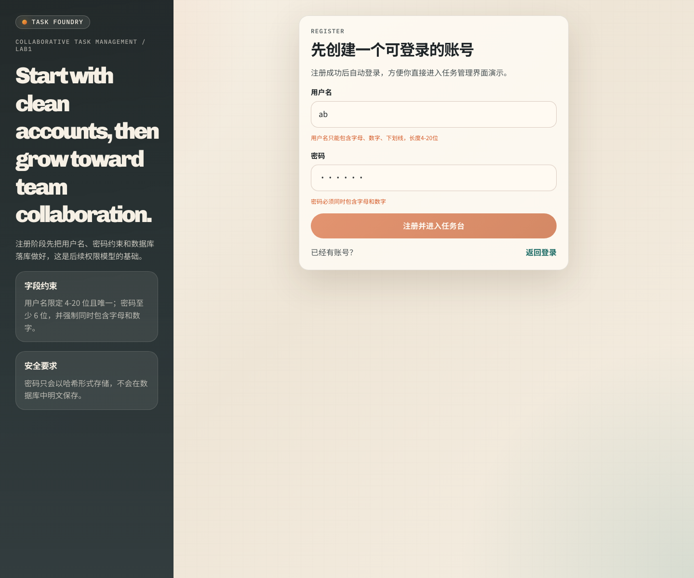

上图展示了注册页在前端输入非法用户名和不合规密码时的实时提示。虽然 Test5 的核心是后端集成测试，但这个界面截图说明前端也与后端规则保持了一致，没有出现“前端能提交、后端再报错”的割裂情况。

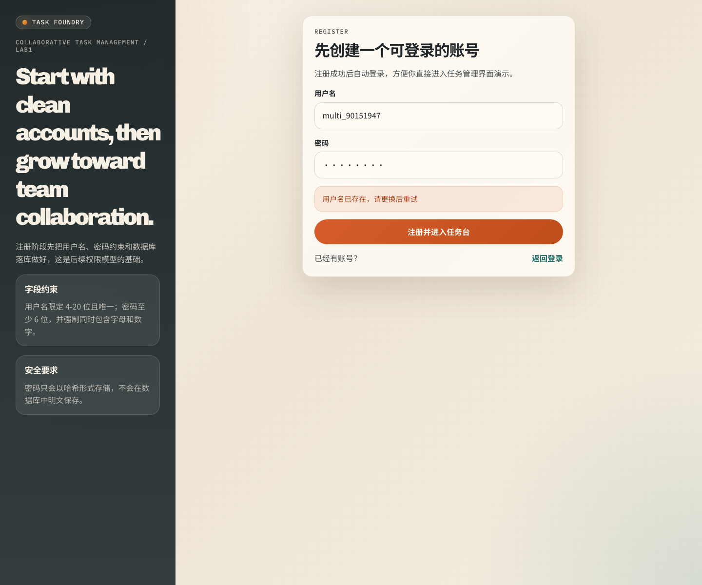

这张图展示了重复注册同一用户名时的页面表现。后端会返回“用户名已存在”，前端则把错误信息直接展示出来，用户能够明确知道失败原因。

### Test6 登录、未登录拦截与无效 Token 集成测试

对应实现：`Lab1RequirementIntegrationTest.loginShouldReturnJwtAndProtectedApisShouldRequireAuthentication`

如果说 Test5 解决的是“如何创建账号”，那么 Test6 解决的就是“账号创建之后能不能形成完整的登录与鉴权闭环”。

这项测试覆盖了四件事：

1. 正确账号 + 错误密码时，登录必须失败；
2. 未登录访问 `/api/tasks` 时，接口必须返回 `401`；
3. 登录成功后，接口返回的 Token 必须可用于访问受保护接口；
4. 如果传入无效 Token，系统也必须明确拦截。

测试实现方式同样是真实起服务后发真实请求。测试先调用注册接口创建一个用户，再用错误密码访问登录接口，检查是否返回“用户名或密码错误”；然后直接不带 Token 去访问任务接口，检查是否返回 `401` 和“未登录”消息；最后再携带正确登录得到的 Token 去访问任务列表，确认能够返回正常结果。为了补足真实浏览器表现，本轮还额外做了“本地篡改 Token 后刷新页面”的回归测试。

这项测试通过，说明当前项目的登录态维护已经不是“页面假装登录成功”，而是前后端真正通过 JWT 串起来了。

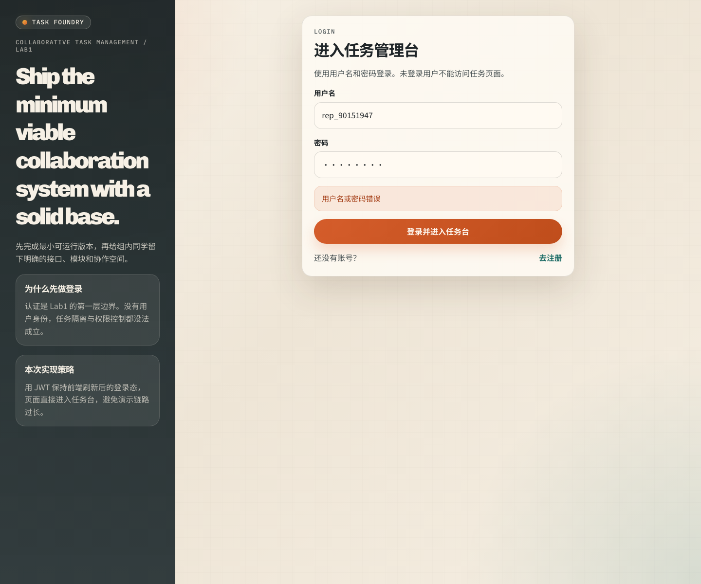

上图展示了错误密码场景。这个场景很重要，因为 Lab1 明确要求“密码错误等异常情况能正确处理并提示”。当前页面会直接给出清晰的错误提示，而不是无反应或只报通用异常。

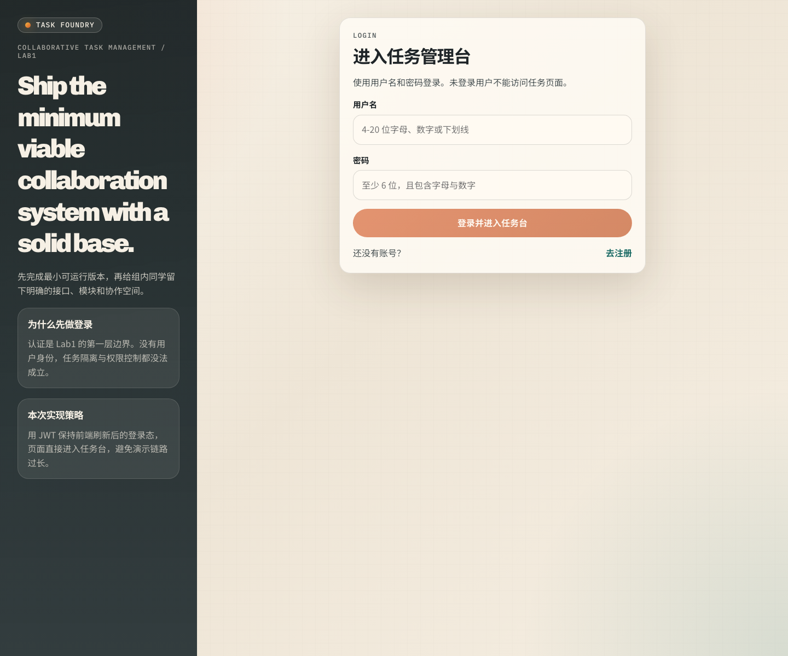

这张图对应的是本轮专门加固过的一类边界情况：用户本地已经保存了失效 Token。现在系统会自动清理本地登录态并跳转回登录页，而不会让用户停留在任务页里反复报错。

### Test7 任务 CRUD 与用户隔离集成测试

对应实现：`Lab1RequirementIntegrationTest.taskCrudShouldPersistDataAndKeepUsersIsolated`

这项测试是当前 Lab1 个人任务功能的核心测试。它覆盖的内容非常完整，包括：

1. 用户 A 创建任务；
2. 用户 A 查询自己的任务列表；
3. 用户 B 尝试访问用户 A 的任务详情；
4. 用户 A 修改自己的任务；
5. 用户 B 尝试删除用户 A 的任务；
6. 用户 A 删除自己的任务；
7. 删除后再次查询，确认数据库里确实没有这条任务了。

这项测试的实现非常接近真实使用流程：先注册并登录两个不同用户，再通过两个不同 Token 访问同一批任务接口。也就是说，它不仅验证 CRUD 是否能跑通，还验证“任务只能由所属用户访问和操作”这一条 Lab1 必需的安全边界。

这项测试通过后，可以比较有把握地说：当前系统的个人任务功能已经不只是“单用户备忘录”，而是真正具备用户隔离的任务系统雏形。

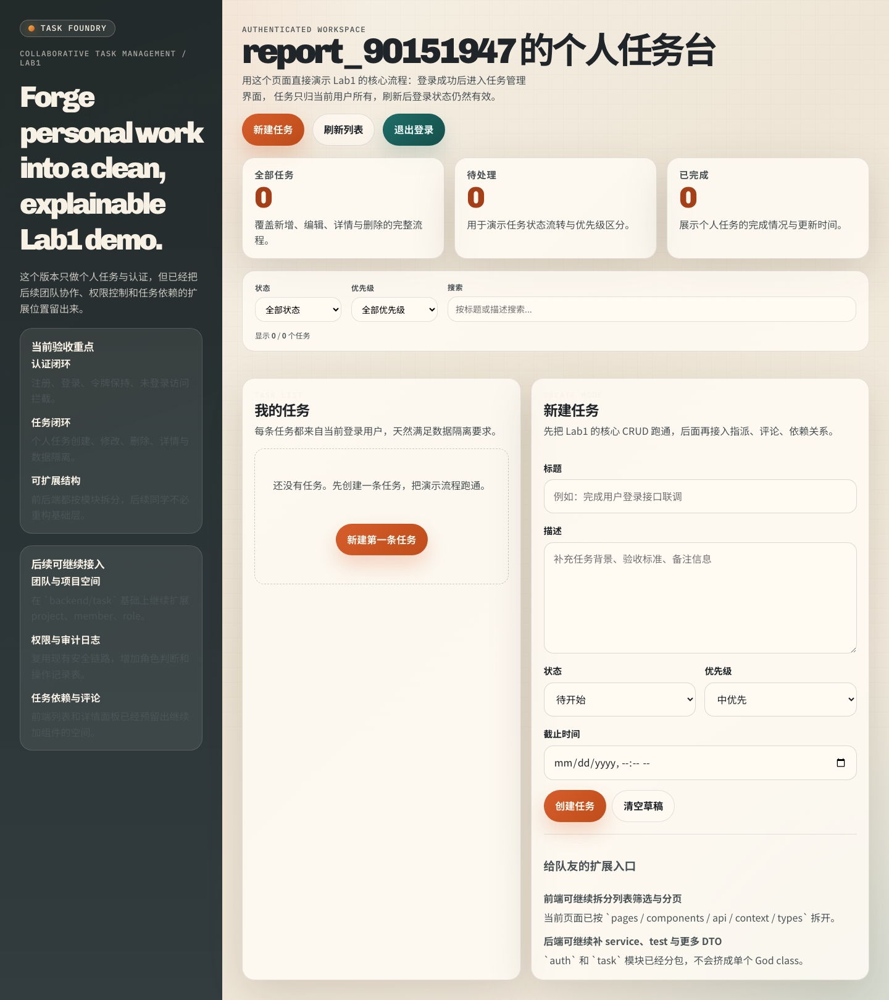

这张图展示的是用户注册成功之后直接进入任务页面的状态。它既能说明注册成功，也能说明系统已经把用户带入任务管理界面，满足 Lab1 对“登录成功后进入任务管理界面”的要求。

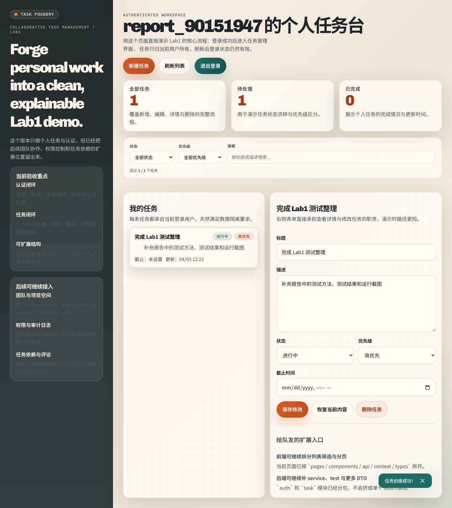

这张图展示了任务创建成功后的真实页面表现。左侧任务列表出现新任务，页面上同时出现成功提示，这与 Test7 中“任务创建并写入数据库”的自动化断言是一致的。

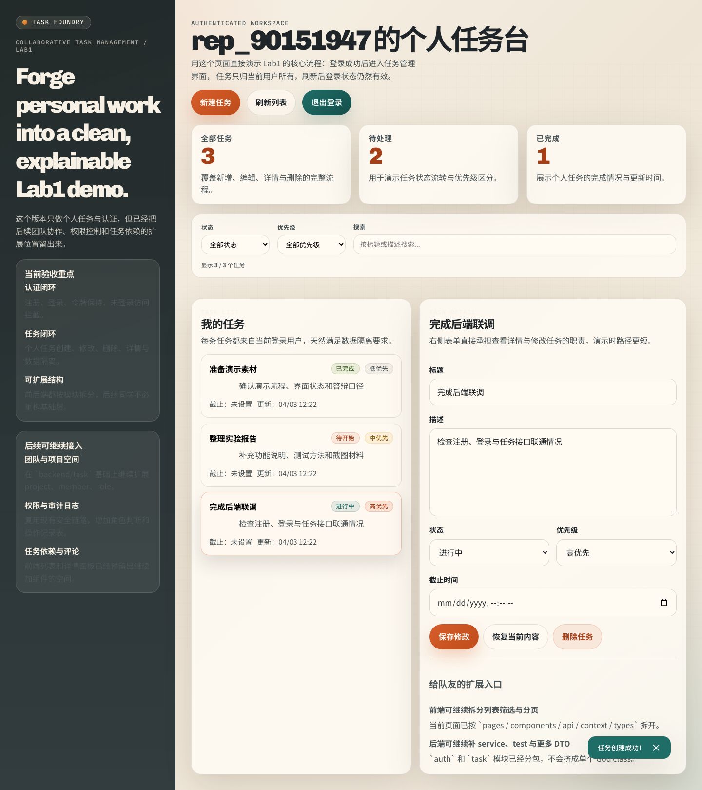

这张图展示的是用户选中任务后进入详情/编辑状态。它对应 Test7 中“查询任务详情并更新任务”的部分，说明前端演示路径也已经接通。

### Test8 分页参数与排序边界测试

对应实现：`Lab1RequirementIntegrationTest.taskListShouldHandlePagingBoundariesAndOutOfRangeRankPages`

这一项测试属于典型的“验收时未必第一眼能看到，但一旦出错就很容易被问住”的边界测试。

它覆盖了四种情况：

1. `page=0` 时，系统应返回 `400`；
2. `size=0` 时，系统应返回 `400`；
3. `size=101` 时，系统应返回 `400`；
4. 当任务数不足一页，但请求 `sortBy=rank&page=2` 时，系统应返回空页而不是直接异常。

这项测试之所以重要，是因为我们本轮确实在这里发现过真实 bug。最早版本在 `sortBy=rank` 且页码越界时，会因为 `subList` 的边界处理不完整而抛出异常。现在修复后，系统会稳定返回空页，同时保留正确的 `totalRecords` 和 `totalPages`。

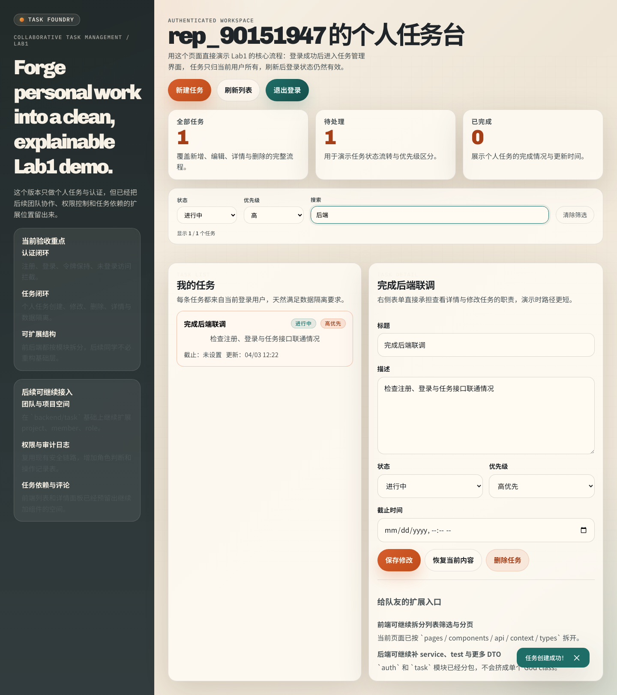

这张图展示了筛选功能的正常工作状态。虽然 Test8 的断言重点在分页边界，但它也说明当前列表查询接口已经支持状态、优先级和关键字条件组合。

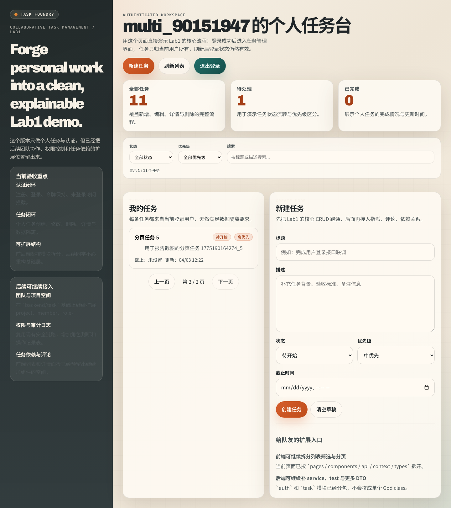

这张图对应分页能力本身。当前前端已经能够根据后端分页结果在页面上切到第二页，这对于任务量增大后的列表展示是必要的。


这张图体现的是另一类细节：当筛选条件组合后没有匹配结果时，页面会给出明确提示，而不是空白一片。这让列表边界处理更完整，也更利于演示。

### Test9 注册接口成功返回结构测试

对应实现：`AuthControllerTest.registerShouldReturnCreated`

Test5 更关注“注册功能整体是否成立”，而 Test9 更关注“控制器层是否按约定返回正确的 HTTP 状态码和 JSON 结构”。

这个测试使用 `@WebMvcTest` 和 `MockMvc`，对 `/api/auth/register` 发起请求，并 mock 掉底层服务逻辑，专注验证控制器行为本身。它要求：

- HTTP 状态码是 `201 Created`
- 响应体中的 `success` 为 `true`
- 提示语是“注册成功”
- 返回数据中带有 `userId` 和 `username`

这项测试通过，说明当前注册接口在前后端协作时具备稳定的返回契约，不会因为服务层改动而把接口格式搞乱。


这张图虽然是页面视角，但它能很好地对应 Test9 的效果：注册成功之后，前端得到了后端返回的认证结果，并顺利进入了任务管理页。

### Test10 登录接口成功返回结构测试

对应实现：`AuthControllerTest.loginShouldReturnOk`

这一项和 Test9 的位置类似，只不过对象变成了登录接口。它的核心是验证：在控制器层面，登录成功时系统是否返回了前端真正需要的结构，包括成功标记、提示语、用户 ID 和用户名。

测试实现仍然是 `MockMvc + @WebMvcTest`。这种测试方式的价值在于，它能在不跑整套集成流程的情况下，快速保证接口契约的稳定性。对于前后端分离项目来说，这一点很重要。

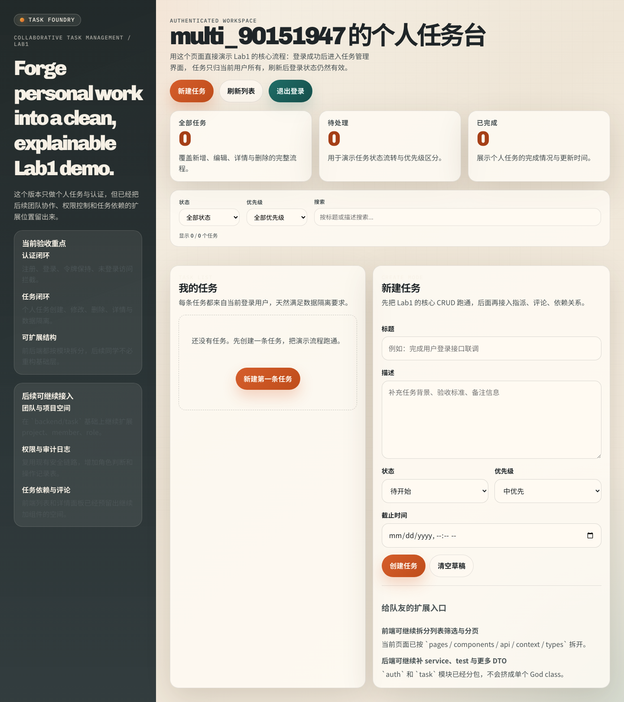

这张图展示的是用户通过登录页成功进入任务台的真实页面状态。它可以作为 Test10 对应的页面证据，说明控制器返回的登录结果已经能被前端正确消费。

### Test11 非法注册请求应返回 Bad Request

对应实现：`AuthControllerTest.registerShouldReturnBadRequestWhenRequestInvalid`

这一项测试专门验证“坏输入”是不是被妥善处理。它会构造一个非法的注册请求，比如过短的用户名和密码，然后发到 `/api/auth/register`。预期结果是：

- 返回 `400 Bad Request`
- 响应体中的 `success` 为 `false`
- `message` 字段不为空

这项测试虽然没有数据库落库那样显眼，但它对实际交互体验很关键。因为如果控制器层对非法输入没有稳定的错误响应，前端就很难展示合理提示，用户只会看到模糊的失败信息。


这张图对应的就是非法注册输入场景。它说明前端已经尽量在提交前做提示，而 Test11 进一步保证即便前端拦不住，后端也会稳稳接住。

### Test12 任务列表接口响应结构测试

对应实现：`TaskControllerTest.listTasksShouldReturnCurrentUsersTasks`

这一项测试验证任务列表接口在控制器层的返回结构，重点看的是：

- 是否返回 `200 OK`
- 是否包含 `records`、`totalRecords`、`totalPages`、`currPage`、`size` 这些分页字段
- 返回的数据是否属于当前用户

测试实现方式是 mock 一个只包含一条任务记录的分页结果，然后通过 `MockMvc` 请求 `/api/tasks?page=1&size=10`。最终要求返回结构与前端实际依赖的字段一致。

这项测试通过，说明前端任务列表页不只是“碰巧能显示”，而是建立在一套明确的分页响应结构之上的。


这张图可以作为 Test12 的页面补充证据。任务台左侧的任务区就是消费这个列表接口数据的地方。

### Test13 创建任务接口成功返回结构测试

对应实现：`TaskControllerTest.createTaskShouldReturnCreated`

这项测试专门对应“创建任务”这个动作在控制器层的表现。它验证的是：当前用户提交合法任务数据后，接口是否返回了正确的 `201 Created`，以及新任务的核心字段是否已经出现在返回体中。

这项测试与 Test7 的区别在于：

- Test7 是“端到端地验证这件事真的发生了”
- Test13 是“更细地验证接口本身的返回格式是否稳定”

两者结合之后，既能保证任务真的被创建，也能保证前端能正确拿到创建结果。


这张图展示了任务创建成功后的页面状态，与 Test13 的控制器层断言形成了前后呼应。

### Test14 任务标题缺失时应返回 Bad Request

对应实现：`TaskControllerTest.createTaskShouldReturnBadRequestWhenTitleMissing`

这一项测试覆盖的是任务创建时的字段校验。它会构造一个标题为空的请求发给 `/api/tasks`，预期系统返回 `400`，并且响应体中的 `success` 为 `false`。

这个测试的意义在于，Lab1 虽然没有把每个字段的校验都写得非常细，但至少一个任务不应该连标题都没有。把这种边界情况固定在测试里，能避免以后功能扩展时把这个最基本的约束弄丢。

从项目表现上看，这项测试通过说明当前后端对任务最基本的结构完整性是有要求的，而不是任意内容都照单全收。

### Test15 删除任务接口成功返回结构测试

对应实现：`TaskControllerTest.deleteTaskShouldReturnSuccess`

最后一项测试对应删除任务接口。它验证的是：当前用户删除指定任务时，接口是否返回 `200 OK`，并给出“任务删除成功”的响应消息。

删除操作是 CRUD 里最容易被忽略的一环，因为很多项目会把“删除按钮能点”当成“删除功能完成”，但实际上这并不等于接口契约稳定，也不等于页面状态刷新正确。当前项目在控制器层和真实页面上都验证了这一点。

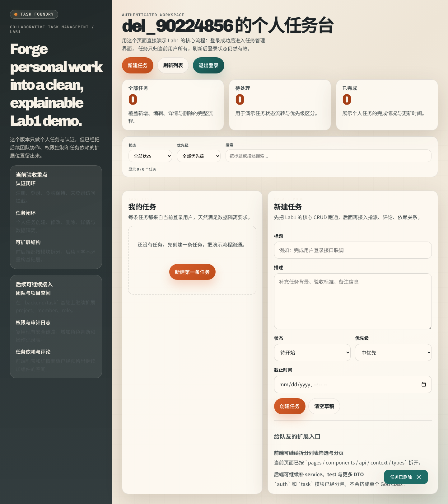

这张图展示了删除动作完成后的真实页面表现。任务被删除后，页面会给出“任务已删除”的提示，说明这一条链路已经闭环。

## 4. 截图汇总说明

本次报告共附上 `13` 张真实运行截图，分别对应注册、登录、任务创建、任务编辑、任务删除、筛选、分页、失效 Token 等场景。截图不是为了“堆图”，而是为了补足自动化测试无法完全体现的交互层证据。

本次实际使用的截图包括：

1. `register-validation.png`
2. `register-duplicate-username.png`
3. `dashboard-after-register.png`
4. `dashboard-task-created.png`
5. `login-validation.png`
6. `login-wrong-password.png`
7. `login-success-dashboard.png`
8. `task-detail-edit.png`
9. `task-filtered-view.png`
10. `pagination-second-page.png`
11. `task-empty-filter-result.png`
12. `invalid-token-redirect.png`
13. `task-delete-result.png`

其中 `login-validation.png` 主要体现登录页的前端实时校验，虽然在上文没有单独展开成一节，但它可以作为 Test6 和 Test10 的辅助展示材料，放入最终 PDF 时也很合适。

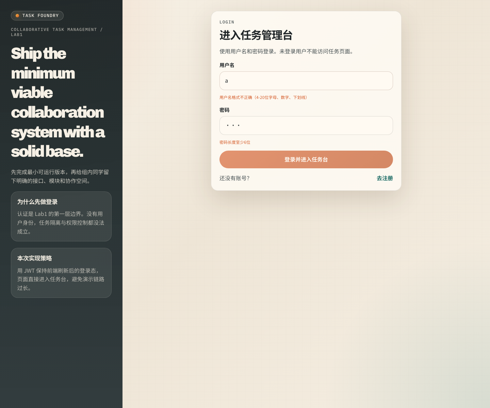

## 5. 本轮测试所说明的项目表现

从这 15 项测试和浏览器回归的结果来看，当前项目已经基本满足了 Lab1 对“最小可运行版本”的要求，而且表现比最初的可运行版本更稳一些。具体可以概括为以下几点：

### 5.1 注册与登录已经形成闭环

当前系统不是只有注册表单和登录表单，而是已经把下面这条链路真正打通了：

`注册 -> 返回认证信息 -> 进入任务页 -> 刷新保持登录态 -> 失效后重新登录`

这说明系统已经具备最基本的身份管理能力。

### 5.2 个人任务功能已经具备完整的 CRUD 能力

当前用户可以创建任务、查看任务列表、查看详情、修改任务、删除任务，而且这些操作都能真实落到数据库里。更重要的是，另一个用户拿着自己的身份访问这些任务时，会被正确拦截。

### 5.3 边界情况比最早版本处理得更完整

本轮测试不是只验证正常流程，还专门压了几类更容易出问题的情况：

- 非法分页参数
- 排序分页越界
- 重复用户名注册
- 错误密码登录
- 未登录访问受保护接口
- 失效 Token 刷新页面
- 前端从 `127.0.0.1` 发起跨域请求

这些情况现在都能得到稳定而可解释的结果，不会轻易在演示时翻车。

### 5.4 当前代码状态适合作为 Lab1 提交版本

从工程角度看，当前前后端都已经可以独立构建、独立测试、独立运行。对于 Lab1 而言，这比“界面能截图”“接口能偶尔通”更重要。因为助教在验收时往往会追问边界情况、异常提示、数据隔离以及登录状态维护，而这些点现在基本都有测试支撑。

## 6. 测试结论

综合自动化测试、静态检查、构建验证和浏览器端真实回归，本组当前版本已经较完整地覆盖了 Lab1 的核心验收要求。

可以得出的结论是：

1. 注册功能满足用户名约束、密码约束、用户名唯一性和密码非明文存储要求。
2. 登录功能能够正确处理成功与失败场景，未登录用户无法访问任务接口，失效登录态也能被正确清理。
3. 个人任务模块已经支持创建、查看、修改、删除，且任务数据具备用户隔离。
4. 当前版本不仅能演示正常流程，也能较稳定地处理一些常见边界情况。
5. 项目已经具备作为 Lab1 提交版本的基本稳定性，并适合作为后续实验继续扩展的基础。

如果需要把这部分内容直接整理进最终实验报告，建议保留本报告中的“功能映射表 + Test1-Test15 详细说明 + 截图章节”这三部分，这样既清楚，也方便答辩时逐条对照说明。
